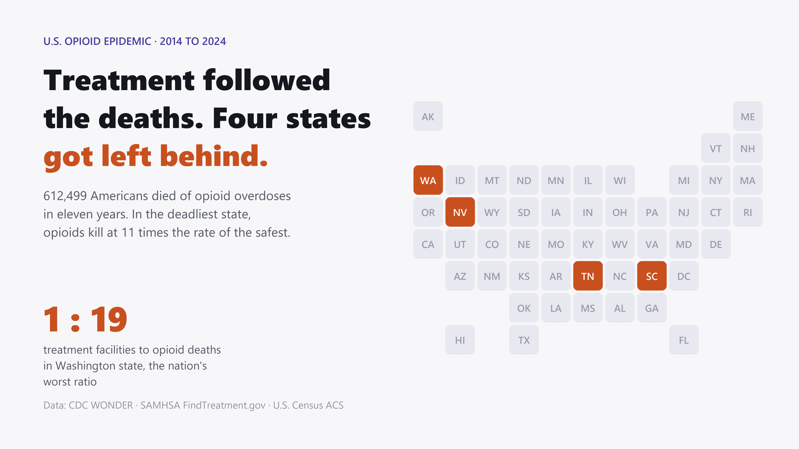

# One Facility for Every Nineteen Deaths

A data story on the U.S. opioid epidemic at the state level: what
**612,499 overdose deaths (2014–2024)** matched against **every treatment
facility in SAMHSA's national locator** reveal about where the burden sits,
where the treatment system followed it, and the four states where it didn't.

> **Live article:** **<https://f-a-tonmoy.github.io/us-opioid-treatment-gap/>**

[](https://f-a-tonmoy.github.io/us-opioid-treatment-gap/)

Built as a reproducible Python pipeline that fetches, cleans, cross-validates,
and renders a single self-contained HTML article with interactive Plotly
charts, a labeled choropleth, dumbbell and slope charts, and scroll-synced
section navigation. Source data: CDC WONDER (databases
[`D157`](https://wonder.cdc.gov/mcd-icd10-expanded.html) + `D77`),
[FindTreatment.gov](https://findtreatment.gov), and the U.S. Census ACS.

---

## Headline numbers

| Stat | Number |
|---|---|
| Opioid overdose deaths, 2014–2024 | **612,499** |
| The 2024 drop, the largest one-year decline on record | **−32%** (81,806 peak → 54,045) |
| Facilities providing buprenorphine or methadone (MOUD) | **7,657** (of 11,614 substance-use facilities) |
| Certified Opioid Treatment Programs, official SAMHSA directory | **2,100** |
| Overdose deaths naming no drug on the certificate | **4%** nationally, **30%** in Louisiana |
| Death-rate gap, worst state (WV) vs best (NE), corrected | **11×** |
| Opioid deaths per treatment facility in Washington state | **19**, the nation's worst ratio |
| Burden ↔ capacity correlation (Spearman) | **+0.40** (+0.67 for OTPs) |
| States above-median burden *and* worst-quartile on three gap measures | **4**: SC, WA, TN, NV |
| Treatment density, Medicaid expansion vs non-expansion states | **2.72** vs **1.46** per 100k |

---

## What's in the article

Ten numbered findings, two self-correction sections, and a "what this data
cannot tell us" caveat section.

1. **The steepest drop on record.** Deaths nearly tripled from 2014 to the
   2022 peak, then fell 32% in 2024 alone, yet 2024 still sits above the
   last pre-pandemic year, and the only earlier decline (2018) lasted one year.
2. **The map the fentanyl era drew.** The burden runs through Appalachia, the
   mid-Atlantic, northern New England, and, new this decade, the Pacific coast.
3. **What the death certificates leave out.** 4% of overdose deaths name no
   drug, and 30% in Louisiana. Correcting for it moves most states four ranks
   or fewer and moves Louisiana 17, into the worst ten in the country.
4. **Every state improved. Some barely.** All 51 jurisdictions are below their
   worst year, but seven of the eight weakest declines are in the West, and
   Alaska is down just 5%.
5. **Counting treatment capacity.** MOUD density varies nine-to-one across
   states; Texas has the fewest facilities per resident.
6. **The Wyoming mirage.** The state that tops the capacity chart has **no**
   certified methadone program at all, and West Virginia caps its own by law.
   The self-reported flag that first suggested otherwise is documented here.
7. **Mostly, treatment follows the burden.** Higher death rates come with
   *more* treatment per resident, though which way that runs is not
   identifiable from a snapshot.
8. **Four states break the pattern.** SC, WA, TN, and NV, selected by a rule
   requiring above-median burden and worst-quartile shortfall on three
   independent measures.
9. **The recovery is not shared.** White Americans' death rate is back to its
   2018 level. Black Americans' is 64% higher; American Indian and Alaska
   Native Americans' is 133% higher.
10. **What money explains, and what policy does.** Income and insurance explain
    none of the gap. Medicaid expansion explains part: non-expansion states
    carry the same burden with about half the treatment.

---

## Tech stack

- **Python**: pandas, SciPy for the pipeline and statistics
- **Plotly**: every interactive chart (labeled choropleth, area trend,
  lollipop bars, dumbbells, quadrant scatter, slope chart)
- **HTML / CSS / vanilla JS**: scroll-synced right-gutter section nav,
  scroll-reveal chart animations, responsive mobile label strategy
- **No backend, no framework**: the deliverable is one self-contained HTML
  file that runs in any modern browser (Plotly via CDN)

---

## Repo layout

```
data/
  README.md                 how to get every dataset (queries, API keys)
  raw/, processed/          gitignored, no data lives in the repo; the
                            pipeline (and one manual CDC export) repopulates it
scripts/
  01_fetch_samhsa.py        Step 1: national facility pull + service taxonomy
  02_fetch_census.py        Step 2: ACS population / income / insurance
  03_clean_merge.py         Step 3: clean, join-audit, merge on state FIPS
  03a_drug_specificity.py   Step 4: correct for incomplete drug reporting
  04_analytics.py           Step 5: rankings, gaps, correlations, cross-checks
  05_build_article.py       Step 6: render index.html from the data
reports/
  hero-image.png            README / LinkedIn / link-preview card
index.html                  THE ARTICLE, served at the Pages root
requirements.txt            Python dependencies
```

---

## How to reproduce

Requires Python 3.10+ and the packages in `requirements.txt`
(pandas, scipy, requests).

```bash
# 1. Environment (venv, conda, uv, whatever you like)
python -m venv .venv
source .venv/bin/activate          # Windows: .venv\Scripts\activate
pip install -r requirements.txt

# 2. Census API key (free; see data/README.md) -> put in .env at the repo root
echo CENSUS_API_KEY=your_key_here > .env

# 3. Fetch the re-fetchable sources
python scripts/01_fetch_samhsa.py
python scripts/02_fetch_census.py
# CDC mortality: no API exists; export manually through the WONDER web UI
# (exact recipe in data/README.md) and save the .txt files to data/raw/cdc/

# 4. Clean, merge, analyse
python scripts/03_clean_merge.py
python scripts/03a_drug_specificity.py
python scripts/04_analytics.py

# 5. Render the article
python scripts/05_build_article.py
# -> writes index.html (the page Pages serves)

# 6. Preview locally
python -m http.server 8000
# open http://localhost:8000/
```

Every number in the article (prose, charts, captions, tables) is
interpolated from the processed data at build time; none are typed by hand.

> **Note on reproducibility.** The FindTreatment.gov locator changes as
> facilities update their own listings, so a fresh pull will differ slightly
> from the September 2026 snapshot behind the article. Mortality and Census
> figures are final published data and reproduce exactly: the two CDC
> databases agree on all 153 overlapping state-year cells, and national
> totals match published NCHS figures to the death. The SAMHSA OTP directory
> is also a live export and will drift as programs are certified or close.

---

## Key conventions in the data

- **Opioid overdose death** = underlying cause is drug overdose (ICD-10
  `X40–44, X60–64, X85, Y10–14`) **and** any opioid (`T40.0–T40.4, T40.6`)
  appears among the multiple causes (CDC's standard definition). Deaths are
  counted by state of residence.
- **Two capacity tiers, from two different sources on purpose:** `OTP` counts
  come from SAMHSA's official certification directory; `MOUD` counts come from
  what facilities report in the treatment locator (buprenorphine or methadone
  in use). They fail differently, which is what makes them usable as
  independent checks. Naltrexone-only listings are excluded. **Counts are not
  capacity**: SAMHSA's facility survey collects client counts, but this
  analysis does not use them.
- **Burden rankings** use 2022–2024 combined rates, corrected for incomplete
  drug reporting; re-ranking on age-adjusted rates moves no state more than
  4 places.
- **DC** is kept in every chart but flagged as a city-vs-states artifact and
  excluded from headline rankings.
- **Grain:** state level, deliberately: county-level CDC mortality data is
  heavily suppressed for small counts.

---

## License

The analysis code in this repository is released as-is for portfolio /
educational use. The underlying data are published by U.S. federal agencies
(CDC/NCHS, SAMHSA, U.S. Census Bureau); CDC WONDER data are subject to its
[data-use restrictions](https://wonder.cdc.gov/datause.html).
